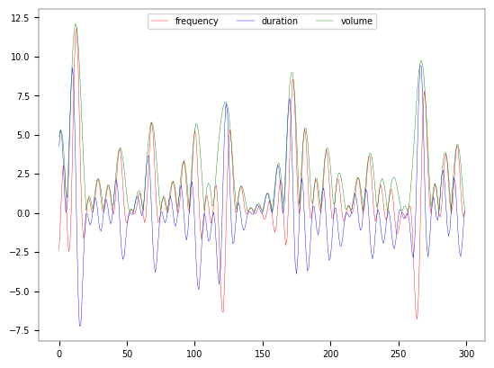

# Visualization-SoundEffects
# Inspired by Vincent Granville as another way to visualize the data
# Sound Generation in Python: Turning Data into Music
 

<!-- # BoxOffice - Prediction of the success of movies
The project objective is to predict profitability of any movie before it is released, with a Return On Investment of 95%. The Target Variable ROI is a computed value of binary class, various Classifiers are being tested  

## Features Importance for Prediction

## Classification Algorithms Tested

  
## Models Accuracy and ROC curve

## XGBoost results - Best Classifiers

  

## Additional run

 Baseline on frequency                                  : 60.333 
 Decision Tree Prediction Accuracy                      : 98.75% 
 Naive Byes Prediction Accuracy                         : 53.50% 
 Logistic Regression Prediction Accuracy                : 68.00% 
 Support Vector Machine Prediction Accuracy             : 68.58% 
 K-Support Vector Machine Prediction Accuracy           : 45.42% 
 K-Nearest Neighbor Prediction Accuracy                 : 39.75% 
 ANN Prediction Accuracy                                : 60.33%  -->

 

